<h1 align="center">
  
  𝐇𝐞𝐥𝐥𝐨, &lt;𝚌𝚘𝚍𝚎𝚛𝚜/&gt;!
  
</h1>

 
 

- 🔭 I'm currently working on **JavaScript and Web Development.**
- 🌱 I'm currently learning **Front-end tools and DSA.**
- 👯 I'm looking to collaborate on **Web Development.**
- 💬 Ask Me About Anything on Instagram **[here](https://www.instagram.com/ig.ashcode/)!** I am happy to help.
- 😄 Pronouns: **He/Him/His.**
- I'm a **Night🦉**
- 📅 I'm **Most Productive** on **Weekends**

- **Mostly Code** in **Visual Studio Code**

 
 

   •
   •
   •
   •
  

#

  
  
  

#

**𝙻𝙰𝙽𝙶𝚄𝙰𝙶𝙴𝚂 𝙰𝙽𝙳 𝚃𝙾𝙾𝙻𝚂:**  

 

<code></code>
<code></code>
<code></code>
<code></code>
<code></code>
<code></code>
<code></code>
<code></code>
<code></code>

#

<code></code>
<code></code>
<code></code>
<code></code>
<code></code>
<code></code>
<code></code>
<code></code>
<code></code>

 

#

  <g-emoji class="g-emoji" alias="chart_with_upwards_trend" fallback-src="https://github.githubassets.com/images/icons/emoji/unicode/1f4c8.png">📈</g-emoji>
  <strong>𝙶𝚒𝚝𝚑𝚞𝚋 𝚂𝚝𝚊𝚝𝚜 : </strong>

 

    
    

 

 

#

  <g-emoji class="g-emoji" alias="chart_with_upwards_trend" fallback-src="https://github.githubassets.com/images/icons/emoji/unicode/1f4c8.png">📈</g-emoji>
  <strong>𝚆𝚊𝚔𝚊𝚃𝚒𝚖𝚎 𝚂𝚝𝚊𝚝𝚜 : </strong>

 
 

<!--START_SECTION:waka-->

<!--END_SECTION:waka-->

  
  

#

    
  <h4 align="center"><code>📊 𝙶𝚒𝚝𝙷𝚞𝚋 𝙼𝚎𝚝𝚛𝚒𝚌𝚜</code></h4>

  
  

<h1>
  Connect With Me
  
</h1>

   
  <a href="https://www.linkedin.com/in/JayantGoel001/" target="_blank">
    <code></code>
  </a>
  <a href="https://www.facebook.com/jayantgoel001/" target="_blank">
    <code></code>
  </a>
  <a href="https://www.instagram.com/jayantgoel001/" target="_blank">
    <code></code>
  </a>
  <a href="https://twitter.com/JayantGoel001" target="_blank">
    <code></code>
  </a>
  <a href="https://dev.to/jayantgoel001">
    <code></code>
  </a>

 

  <a href="https://www.hackerrank.com/JayantGoel001/" target="_blank">
    <code></code>
  </a>

  <a href="http://www.codeforces.com/profile/JayantGoel001" target="_blank">
    <code></code>
  </a>

  <a href="https://www.hackerearth.com/@jayantgoel001" target="_blank">
    <code></code>
  </a>

  <a href="https://www.codechef.com/users/jayantgoel001" target="_blank">
    <code></code>
  </a>
  
  <a href="https://leetcode.com/JayantGoel001/" target="_blank">
    <code></code>
  </a>

 
 

### 𝚂𝚑𝚘𝚠 𝚜𝚘𝚖𝚎 ❤️ 𝚋𝚢 𝚜𝚝𝚊𝚛𝚛𝚒𝚗𝚐 𝚜𝚘𝚖𝚎 𝚘𝚏 𝚝𝚑𝚎 𝚛𝚎𝚙𝚘𝚜𝚒𝚝𝚘𝚛𝚒𝚎𝚜

#

